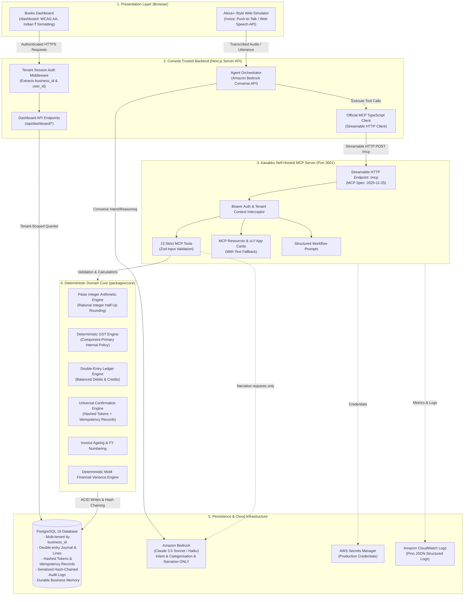
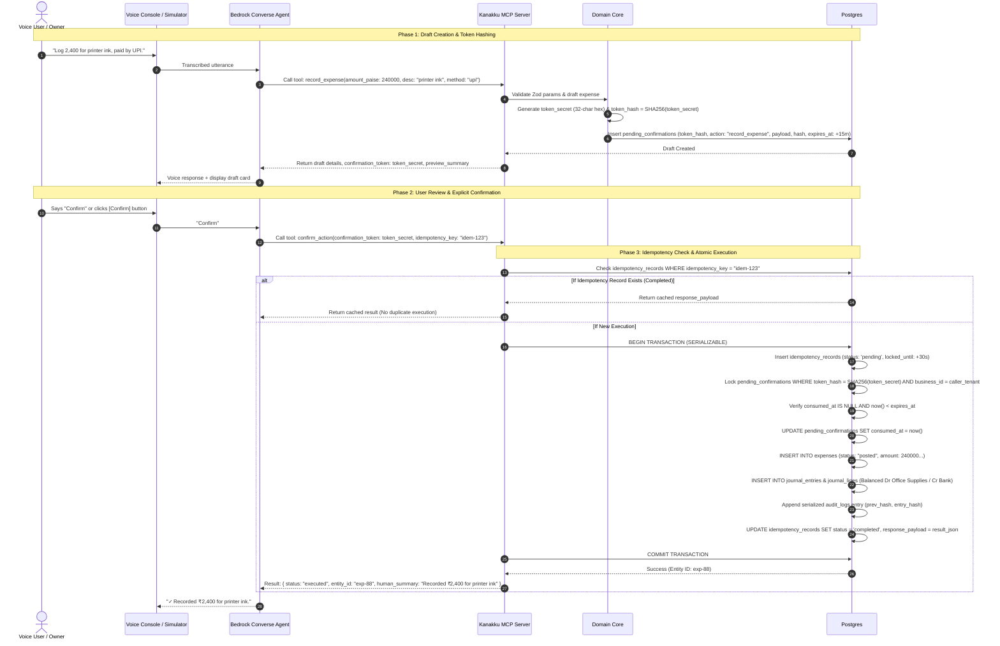

# Kanakku — Phase 0 Architecture Blueprint (Revision 4 — Final Hardened)

**Amazon Developer Hackathon 2026 — Alexa+ & AWS Builder Mini Challenge**

---

## 1. Monorepo Folder Tree

```text
kanakku/
├── .github/
│   └── workflows/
│       ├── ci.yml                 # Lint, typecheck, test, build
│       └── deploy.yml             # Optional AWS App Runner / ECR deploy pipeline
├── apps/
│   ├── mcp-server/                # Standalone MCP Server (@modelcontextprotocol/sdk)
│   │   ├── src/
│   │   │   ├── index.ts           # Streamable HTTP server entrypoint (/mcp)
│   │   │   ├── server.ts          # McpServer instance & lifecycle
│   │   │   ├── auth/              # Bearer token tenant extraction & middleware
│   │   │   ├── tools/             # 13 MCP tool implementations with Zod schemas
│   │   │   ├── resources/         # Standard resources & ui:// MCP App card templates
│   │   │   ├── prompts/           # month_end_close, weekly_briefing, business_briefing
│   │   │   └── utils/             # Request ID, Pino structured logger, hash chain
│   │   ├── tsconfig.json
│   │   └── package.json
│   └── console/                   # Next.js 15 App Router (Voice Console + Books Dashboard)
│       ├── src/
│       │   ├── app/
│       │   │   ├── layout.tsx
│       │   │   ├── page.tsx       # Root landing / redirect
│       │   │   ├── api/           # Authenticated Server Route Handlers for Dashboard & Voice
│       │   │   │   ├── auth/      # Session verification
│       │   │   │   ├── dashboard/ # Multi-tenant backend query endpoints
│       │   │   │   └── voice/     # Bedrock Converse orchestrator proxy
│       │   │   ├── voice/         # Alexa+-style Conversational Web Simulator
│       │   │   └── dashboard/     # Books Dashboard (Overview, Invoices, Expenses, GST, etc.)
│       │   ├── components/
│       │   │   ├── voice/         # Push-to-talk, live waveform, speech-to-text, tool chips
│       │   │   ├── cards/         # MCP App Card renderers (Invoice, GST, MonthEnd, etc.)
│       │   │   ├── confirmation/  # Draft Review & Confirm modal/banner
│       │   │   └── dashboard/     # Metric cards, data tables, Indian currency formatters
│       │   ├── lib/
│       │   │   ├── bedrock/       # Bedrock Converse client & orchestrator
│       │   │   └── mcp-client/    # Streamable HTTP MCP client wrapper
│       │   └── styles/
│       ├── tsconfig.json
│       └── package.json
├── packages/
│   ├── core/                      # Framework-agnostic pure domain logic
│   │   ├── src/
│   │   │   ├── money/             # Integer paise arithmetic, formatters, rational rounding
│   │   │   ├── gst/               # Deterministic GST engine (Component-primary, ITC estimate, Sec 49)
│   │   │   ├── ledger/            # Double-entry balance calculation, journal rules
│   │   │   ├── invoice/           # FY-aware numbering, state machine, ageing buckets
│   │   │   ├── confirmation/      # Hashed token lifecycle & idempotency manager
│   │   │   ├── memory/            # Business memory lifecycle & session context resolution
│   │   │   └── insights/          # Deterministic month-over-month variance & anomaly engine
│   │   ├── tsconfig.json
│   │   └── package.json
│   ├── db/                        # PostgreSQL + Drizzle ORM
│   │   ├── src/
│   │   │   ├── schema/            # Multi-tenant tables, double-entry, token hashes, idempotency
│   │   │   ├── migrations/        # Drizzle migration files
│   │   │   ├── client.ts          # Connection pooler & tenant query helpers
│   │   │   └── seed/              # 3-month deterministic Indian SMB dataset
│   │   ├── drizzle.config.ts
│   │   ├── tsconfig.json
│   │   └── package.json
│   ├── ui/                        # Reusable Tailwind/React design system tokens & primitives
│   │   ├── src/
│   │   ├── tsconfig.json
│   │   └── package.json
│   ├── config/                    # Shared TypeScript, ESLint, Prettier, Tailwind configurations
│   └── types/                     # Shared domain, DTO, MCP, and Bedrock schema contracts
├── infra/
│   ├── docker/
│   │   ├── Dockerfile.mcp-server
│   │   └── Dockerfile.console
│   └── terraform/                 # Optional AWS App Runner / RDS CDK / manifests
├── docs/
│   ├── adr/                       # ADR-001 through ADR-005
│   ├── architecture.md
│   └── aws.md
├── tests/
│   ├── e2e/                       # Playwright end-to-end voice/dashboard smoke tests
│   └── fixtures/                  # Deterministic test payloads
├── docker-compose.yml             # Local Postgres 16 container setup
├── pnpm-workspace.yaml
├── package.json
├── tsconfig.base.json
├── FRICTION_LOG.md
├── FEEDBACK.md
└── README.md
```

---

## 2. System Architecture Diagram



---

## 3. Database Schema (`packages/db`)

All monetary figures are stored as `bigint` integer paise ($1\text{ INR} = 100\text{ paise}$). Multi-tenancy is enforced via `business_id` across every business-owned entity.

1. **`businesses`**: `id` (UUID), `name`, `legal_name`, `gstin`, `state_code` (e.g. `"33"` Tamil Nadu), `pan`, `currency` (`INR`), `financial_year_start_month` (4), `created_at`, `updated_at`.
2. **`users`**: `id` (UUID), `business_id` (FK), `email`, `name`, `role` (`owner` | `accountant`), `api_key_hash`, `created_at`.
3. **`customers`**: `id` (UUID), `business_id` (FK), `name`, `contact_name`, `email`, `phone`, `gstin`, `state_code`, `is_composition`, `created_at`, `updated_at`.
4. **`customer_addresses`**: `id` (UUID), `customer_id` (FK), `line1`, `line2`, `city`, `state`, `state_code`, `pincode`, `is_billing_default`, `is_shipping_default`.
5. **`chart_of_accounts`**: `id` (UUID), `business_id` (FK), `code` (e.g. `1110` Bank, `1120` Accounts Receivable, `2110` Output CGST, `2120` Output SGST, `2130` Output IGST, `1210` Input CGST, `1220` Input SGST, `1230` Input IGST, `4100` Sales Revenue, `5100` Office Supplies), `name`, `type` (`asset`, `liability`, `equity`, `revenue`, `expense`).
6. **`expense_categories`**: `id` (UUID), `business_id` (FK), `name`, `gl_account_id` (FK), `default_gst_rate_bps` (integer basis points, e.g. `1800` for 18%), `is_itc_eligible` (boolean: false for Section 17(5) blocked credits).
7. **`expenses`**: `id` (UUID), `business_id` (FK), `category_id` (FK, nullable), `amount_paise` (bigint), `taxable_amount_paise`, `cgst_paise`, `sgst_paise`, `igst_paise`, `gst_rate_bps`, `is_itc_claimed`, `payment_method` (`upi`, `bank_transfer`, `card`, `cash`), `expense_date` (date), `vendor_name`, `vendor_gstin`, `description`, `receipt_url`, `status` (`draft`, `posted`, `cancelled`), `created_at`.
8. **`invoices`**: `id` (UUID), `business_id` (FK), `customer_id` (FK), `invoice_number` (`KAN/2026-27/0042`), `financial_year` (`2026-27`), `issue_date` (date), `due_date` (date), `place_of_supply_state_code` (2 digits), `is_inter_state` (boolean), `subtotal_paise` (bigint), `cgst_paise`, `sgst_paise`, `igst_paise`, `total_paise` (bigint), `paid_amount_paise` (bigint default 0), `status` (`draft`, `issued`, `partially_paid`, `paid`, `cancelled`), `created_at`, `updated_at`.
9. **`invoice_items`**: `id` (UUID), `invoice_id` (FK), `description`, `hsn_sac_code`, `quantity` (integer units), `unit_price_paise` (bigint), `taxable_amount_paise` (bigint), `gst_rate_bps` (integer), `cgst_paise`, `sgst_paise`, `igst_paise`, `total_paise` (bigint).
10. **`payments`**: `id` (UUID), `business_id` (FK), `invoice_id` (FK, nullable), `customer_id` (FK), `amount_paise` (bigint), `payment_date` (date), `payment_mode` (`upi`, `neft`, `rtgs`, `cheque`), `reference_number`, `status` (`recorded`, `reconciled`), `notes`.
11. **`credit_notes`**: `id` (UUID), `business_id` (FK), `original_invoice_id` (FK), `credit_note_number`, `reason`, `taxable_amount_paise`, `cgst_paise`, `sgst_paise`, `igst_paise`, `total_paise`, `status`.
12. **`journal_entries`**: `id` (UUID), `business_id` (FK), `entry_number` (text), `entry_date` (date), `source_entity_type` (`invoice`, `expense`, `payment`, `credit_note`, `month_close`), `source_entity_id` (UUID), `narration` (text), `created_at` (timestamptz).
13. **`journal_lines`**: `id` (UUID), `journal_entry_id` (FK), `account_id` (FK), `debit_paise` (bigint default 0), `credit_paise` (bigint default 0). _(Invariant: Sum of debits equals sum of credits)_.
14. **`payment_reminders`**: `id` (UUID), `business_id` (FK), `customer_id` (FK), `invoice_id` (FK), `channel` (`whatsapp`, `email`), `tone` (`polite`, `firm`), `recipient_contact`, `message_body`, `status` (`draft`, `scheduled`, `sent_demo`, `failed`), `sent_at`, `created_at`.
15. **`conversation_sessions`**: `id` (UUID), `business_id` (FK), `session_key` (text, indexed), `last_active_at`, `created_at`.
16. **`session_context`**: `id` (UUID), `session_id` (FK), `last_customer_id` (FK, nullable), `last_invoice_id` (FK, nullable), `last_confirmation_token_hash` (text, nullable), `active_workflow_name` (text, nullable), `active_workflow_state` (jsonb, nullable), `updated_at`. _(Ephemeral; resets after 1 hour inactivity)_.
17. **`business_memory`**: `id` (UUID), `business_id` (FK), `category` (`customer_preference`, `categorization_override`, `operational_policy`), `entity_key` (text, e.g. customer ID or vendor pattern), `memory_value` (jsonb), `confidence` (numeric), `source` (`user_explicit`, `confirmed_action`), `is_active` (boolean default true), `expires_at` (timestamptz, nullable), `updated_at`. _(Durable across sessions with explicit lifecycle: active, update, forget)_.
18. **`pending_confirmations`**:

- `id`: UUID (PK)
- `business_id`: UUID NOT NULL (FK)
- `user_id`: UUID NOT NULL (FK)
- `token_hash`: text NOT NULL UNIQUE (SHA-256 of the issued confirmation secret; raw token is NEVER stored)
- `action_type`: text NOT NULL (`record_expense`, `create_invoice`, `send_payment_reminder`, `close_month`)
- `payload`: jsonb NOT NULL (canonical action arguments)
- `payload_hash`: text NOT NULL (SHA-256 of canonical payload JSON)
- `human_summary`: text NOT NULL
- `expires_at`: timestamptz NOT NULL (now() + 15 minutes)
- `consumed_at`: timestamptz NULL (set atomically upon confirmation or cancellation)
- `created_at`: timestamptz default now()

19. **`idempotency_records`**:

- `id`: UUID (PK)
- `business_id`: UUID NOT NULL (FK)
- `idempotency_key`: text NOT NULL
- `action_type`: text NOT NULL
- `status`: text NOT NULL (`pending`, `completed`, `failed`)
- `response_payload`: jsonb NULL (persisted executed result for idempotent replay)
- `locked_until`: timestamptz NOT NULL
- `created_at`: timestamptz default now()
- Constraints: `UNIQUE(business_id, idempotency_key)`

20. **`audit_logs`**:

- `id`: UUID (PK)
- `business_id`: UUID NOT NULL (FK)
- `sequence_number`: bigint NOT NULL (monotonically incrementing per tenant, protected by write lock)
- `request_id`: text NOT NULL
- `user_id`: UUID NULL (FK)
- `source`: text NOT NULL (`voice`, `console_web`, `mcp_client`)
- `tool_name`: text NOT NULL
- `action`: text NOT NULL
- `entity_type`: text NOT NULL
- `entity_id`: UUID NULL
- `before_state`: jsonb NULL
- `after_state`: jsonb NULL
- `confirmation_token_hash`: text NULL
- `payload_hash`: text NOT NULL
- `prev_hash`: text NOT NULL (SHA-256 of sequence $N-1$; for sequence 1, `GENESIS_HASH`)
- `entry_hash`: text NOT NULL (`SHA256(prev_hash + sequence_number + timestamp + action + entity_id + payload_hash)`)
- `created_at`: timestamptz default now()

21. **`month_end_reports`**: `id` (UUID), `business_id` (FK), `month` (integer 1-12), `year` (integer), `is_closed` (boolean), `summary_json` (jsonb), `narration_markdown` (text), `closed_at` (timestamptz, nullable), `closed_by_user_id` (FK, nullable).

---

## 4. Deterministic Financial & GST Arithmetic Specification

### 4.1. Kanakku Deterministic Internal Policy (Component-Primary Integer Rounding)

To ensure mathematical determinism and avoid odd-paise discrepancies across invoice line items, Kanakku adheres to an internal **Component-Primary Integer Rounding Policy**:

1. **Rational Rounding Helper**:
   All divisions are integer operations with standard half-up rounding:
   $$\text{roundHalfUp}(N, D) = \left\lfloor \frac{N + \lfloor D / 2 \rfloor}{D} \right\rfloor$$
2. **Intra-State Supplies ($\text{seller\_state} == \text{pos\_state}$)**:
   - CGST and SGST are levied at half the item's total basis points:
     $$\text{cgst\_rate\_bps} = \frac{\text{gst\_rate\_bps}}{2}, \quad \text{sgst\_rate\_bps} = \frac{\text{gst\_rate\_bps}}{2}$$
   - Each component is computed independently using rational half-up rounding:
     $$\text{cgst\_paise} = \text{roundHalfUp}(\text{taxable\_amount\_paise} \times \text{cgst\_rate\_bps}, 10000)$$
     $$\text{sgst\_paise} = \text{roundHalfUp}(\text{taxable\_amount\_paise} \times \text{sgst\_rate\_bps}, 10000)$$
     $$\text{igst\_paise} = 0$$
   - Since $\text{cgst\_rate\_bps} \equiv \text{sgst\_rate\_bps}$, it is a mathematical guarantee that:
     $$\text{cgst\_paise} \equiv \text{sgst\_paise}$$
   - The total tax for the line item is **defined strictly as the sum of its components**:
     $$\text{line\_tax\_paise} = \text{cgst\_paise} + \text{sgst\_paise} = 2 \times \text{cgst\_paise}$$
   - _Result_: The intra-state tax is **always an even integer of paise**, eliminating any odd-paise split conflict. (e.g. 18% of 3 paise: CGST = 0 paise, SGST = 0 paise, Line Tax = 0 paise; 18% of 6 paise: CGST = 1 paise, SGST = 1 paise, Line Tax = 2 paise).
3. **Inter-State Supplies ($\text{seller\_state} \neq \text{pos\_state}$)**:
   - Levied at the full rate:
     $$\text{cgst\_paise} = 0, \quad \text{sgst\_paise} = 0$$
     $$\text{igst\_paise} = \text{roundHalfUp}(\text{taxable\_amount\_paise} \times \text{gst\_rate\_bps}, 10000)$$
     $$\text{line\_tax\_paise} = \text{igst\_paise}$$
4. **Line and Invoice Totals**:
   $$\text{line\_total\_paise} = \text{taxable\_amount\_paise} + \text{line\_tax\_paise}$$
   $$\text{invoice\_subtotal\_paise} = \sum \text{line.taxable\_amount\_paise}$$
   $$\text{invoice\_total\_tax\_paise} = \sum \text{line.cgst\_paise} + \sum \text{line.sgst\_paise} + \sum \text{line.igst\_paise}$$
   $$\text{invoice\_grand\_total\_paise} = \text{invoice\_subtotal\_paise} + \text{invoice\_total\_tax\_paise}$$
   _(Optional invoice-level rounding to the nearest ₹1 per Section 170 CGST Act is stored as an explicit `round_off_paise` adjustment line)._

### 4.2. Bounded Input Tax Credit (ITC) & Net Liability Scope

> **Statutory Scope Boundary**: In Indian tax administration, official ITC claims require cross-matching against electronic invoices auto-populated in GSTR-2B from supplier filings (Section 16(2)(aa) CGST Act). Kanakku does not integrate with the live GSTN portal API for supplier GSTR-1 filings.
> **Therefore, Kanakku's ITC computation is explicitly bounded as an "Internal Decision-Support Estimate"** based on recorded business expenses:

1. **ITC Eligibility Heuristics**:
   - Requires non-null, valid format vendor GSTIN (`^\d{2}[A-Z]{5}\d{4}[A-Z]{1}[1-9A-Z]{1}Z[0-9A-Z]{1}$`).
   - Requires expense category to be marked `is_itc_eligible = true`.
   - Expenses categorized under Section 17(5) blocked credits (food & beverages, personal motor transport, club memberships, employee personal gifts) are automatically tagged `is_itc_eligible = false` and yield ₹0 ITC.
2. **Set-off Sequence (Sections 49, 49A, 49B of CGST Act)**:
   - Output Tax = Sum of taxes on all issued invoices minus credit notes in the period.
   - Input Tax Credit (ITC) = Sum of taxes on verified eligible expenses in the period.
   - **Order of Utilization**:
     1. IGST Credit is first set off against Output IGST, then Output CGST, then Output SGST.
     2. CGST Credit is set off against Output CGST, then remaining against Output IGST. _(CGST credit cannot set off SGST liability)_.
     3. SGST Credit is set off against Output SGST, then remaining against Output IGST. _(SGST credit cannot set off CGST liability)_.
     4. Net Cash Liability = Remainder Output CGST, SGST, IGST payable.

---

## 5. Universal Confirmation, Hashed Token Storage & Idempotency Lifecycle

Every state-changing operation strictly implements the four-phase protocol:
$$\mathbf{DRAFT} \longrightarrow \mathbf{REVIEW} \longrightarrow \mathbf{CONFIRM} \longrightarrow \mathbf{EXECUTE}$$



### 5.1. Token Storage, Expiration & Cancellation Contracts

- **Token Secret Generation**: Cryptographically secure 32-character hex string (`crypto.randomBytes(16).toString('hex')`).
- **Hashed Storage**: Only `SHA-256(token_secret)` is stored in `pending_confirmations.token_hash`. Plaintext tokens are never stored.
- **Lookup**: On `confirm_action(confirmation_token)`, the server computes `SHA-256(confirmation_token)` and checks `token_hash`.
- **Cancellation**: `cancel_action(confirmation_token: string, reason?: string)` marks the token void (`consumed_at = now()`) so it cannot be executed later.

---

## 6. Audit Trail Architecture: Serialization & Tamper Detection

### 6.1. Bounded Security Model

> **Threat Model Boundary**: An application-level hash chain detects accidental row modification, unauthorized SQL updates that do not reconstruct downstream hashes, or application-level bugs. It does **not** protect against a privileged database superuser with full schema access who deliberately rewrites rows and recomputes all downstream hashes.
> In production (Phase 7), Kanakku pairs this with an external append-only log sink (Amazon CloudWatch Logs / S3 Object Lock) where the latest `entry_hash` is anchored periodically.

### 6.2. Write-Ordering & Serialization Model

To prevent concurrency branching where two simultaneous writes reference the same `prev_hash`:

1. Every write to `audit_logs` executes within a tenant-scoped transaction.
2. The transaction acquires a PostgreSQL advisory lock on the `business_id`:
   `SELECT pg_advisory_xact_lock(hashtext('audit_lock_' || $business_id))`
3. Inside the lock:
   - Fetches the current head: `SELECT sequence_number, entry_hash FROM audit_logs WHERE business_id = $1 ORDER BY sequence_number DESC LIMIT 1`.
   - Next sequence = `current.sequence_number + 1` (or 1 for genesis).
   - `prev_hash` = `current.entry_hash` (or `GENESIS_HASH`).
   - Computes:
     $$\text{entry\_hash} = \text{SHA256}(\text{prev\_hash} + \text{sequence\_number} + \text{timestamp} + \text{action} + \text{entity\_id} + \text{payload\_hash})$$
   - Inserts the new log entry with the newly computed hash.
4. **Verification**: `verifyAuditChain(businessId)` reads rows in ascending `sequence_number` order, recomputes each `entry_hash`, and asserts that `entry[N].prev_hash === entry[N-1].entry_hash`. Any alteration immediately halts verification.

---

## 7. Business Memory Lifecycle

| Operation            | Trigger / Voice Utterance                                                        | Behavior & Persistence                                                                                                                       |
| :------------------- | :------------------------------------------------------------------------------- | :------------------------------------------------------------------------------------------------------------------------------------------- |
| **Record / Learn**   | User confirms action (e.g. sends reminder to Ravi via WhatsApp with polite tone) | Inserts or updates `business_memory` row with `entity_key = "customer:ravi-traders"`, `category = "customer_preference"`, confidence = 0.95. |
| **Retrieve**         | User says: _"Send Ravi a reminder"_                                              | Resolves default tone (`polite`) and channel (`whatsapp`) from `business_memory`.                                                            |
| **Correct**          | User says: _"No, make it firm this time"_                                        | Overrides preference for this turn, updates `business_memory` with new preferred tone.                                                       |
| **Forget / Delete**  | User says: _"Forget my preference for Ravi"_ or deletes in dashboard             | Sets `is_active = false` or deletes row in `business_memory`. System returns to asking for explicit channel/tone.                            |
| **Lifecycle Bounds** | Optional `expires_at`                                                            | Allows time-limited preferences (e.g. festival promotion period). Inactive preferences are ignored during resolution.                        |

---

## 8. Complete MCP Tool Table (13 Tools)

| Tool Name                   |   Type   | Purpose                                       | Inputs                                                                                        | Returns                                                                                             | Side Effect / Safety Rule                                                                                                      |
| :-------------------------- | :------: | :-------------------------------------------- | :-------------------------------------------------------------------------------------------- | :-------------------------------------------------------------------------------------------------- | :----------------------------------------------------------------------------------------------------------------------------- |
| `record_expense`            |  Draft   | Prepare expense from voice/text               | `amount_paise`, `description`, `payment_method`, `date`, `vendor?`, `category?`               | `draft_id`, `suggested_category`, `confidence`, `confirmation_token`, `preview_summary`             | Draft only. Books untouched. Valid for 15 mins.                                                                                |
| `create_invoice`            |  Draft   | Prepare sales invoice draft                   | `customer_id` or `name`, `line_items`, `place_of_supply`, `due_date`                          | `draft_id`, `subtotal_paise`, `gst_breakdown`, `total_paise`, `confirmation_token`                  | Draft only. Invoice sequence number not incremented.                                                                           |
| `send_payment_reminder`     |  Draft   | Prepare collection reminder                   | `customer_id` or `name`, `invoice_id?`, `tone`, `channel`                                     | `recipient_name`, `contact`, `amount_due_paise`, `message_preview`, `confirmation_token`            | External side-effect guard. Exact copy previewed before send.                                                                  |
| `close_month`               | Agentic  | Multi-step month close workflow               | `month`, `year`, `step: "scan" \| "categorise" \| "reconcile" \| "prepare_close"`, `payload?` | `workflow_state`, `clarification_questions`, `draft_report`, `confirmation_token`                   | Resumable state machine. Final closure requires token confirmation.                                                            |
| `confirm_action`            | **Exec** | **Universal executor for all pending drafts** | `confirmation_token`, `idempotency_key?`                                                      | `status: "executed"`, `action_type`, `entity_id`, `audit_id`, `human_summary`                       | **Consumes token atomically**. Posts ledger, double-entry journal lines, records idempotency result, and serialized audit log. |
| `cancel_action`             |  Cancel  | Explicitly abort a pending draft              | `confirmation_token`, `reason?`                                                               | `status: "cancelled"`, `message`                                                                    | Marks token void without ledger execution.                                                                                     |
| `list_outstanding_invoices` |   Read   | Fetch receivables & ageing buckets            | `as_of_date?`, `customer_id?`                                                                 | `total_outstanding_paise`, `overdue_total_paise`, `ageing_buckets`, `invoices_list`                 | Read-only. Scoped to authenticated tenant.                                                                                     |
| `get_gst_liability`         |   Read   | Deterministic GST liability for period        | `month`, `year`                                                                               | `output_tax`, `estimated_itc`, `net_payable`, `cgst_paise`, `sgst_paise`, `igst_paise`, `mom_delta` | Pure domain engine. Section 49 set-off calculation. Labeled as estimated ITC.                                                  |
| `cashflow_summary`          |   Read   | Realized cash movements                       | `from_date`, `to_date`, `comparison_period?`                                                  | `inflow_paise`, `outflow_paise`, `net_cashflow_paise`, `major_movements`                            | Read-only payments and expenses ledger query.                                                                                  |
| `whats_changed_since`       |   Read   | Delta intelligence across sessions            | `since_timestamp` or `reference: "last_briefing"`                                             | `new_invoices_count`, `payments_received_paise`, `new_overdues`, `expense_surges`, `gst_delta`      | Evaluates ledger deltas against baseline timestamp.                                                                            |
| `get_business_briefing`     |   Read   | Executive snapshot (daily/weekly)             | `timeframe: "today" \| "weekly"`                                                              | `cash_inflow`, `overdue_receivables`, `upcoming_bills`, `gst_liability_estimate`, `action_items`    | Concise voice summary (<= 2 sentences) + rich card payload.                                                                    |
| `explain_transaction`       |   Read   | Double-entry journal & tax breakdown          | `transaction_id`, `entity_type`                                                               | `entity_details`, `journal_entries: [{dr, cr, account}]`, `gst_impact`, `audit_trail`               | Real double-entry debits/credits with Bedrock explanation.                                                                     |
| `get_audit_history`         |   Read   | Serialized audit trail query                  | `from_date?`, `to_date?`, `entity_type?`, `action?`, `limit?`                                 | `logs: [{ sequence_number, request_id, who, when, action, prev_hash, entry_hash }]`                 | Read-only query into append-only audit trail.                                                                                  |

---

## 10. MCP Apps Extension & Interactive UI Cards Architecture

### 10.1 Protocol & Media Type
Kanakku supports the official Model Context Protocol UI extension (`io.modelcontextprotocol/ui`):
- **Resource MIME Type**: `text/html;profile=mcp-app`
- **Resource URIs**: `ui://cards/invoice-draft`, `ui://cards/expense-draft`, `ui://cards/payment-reminder-draft`, `ui://cards/month-end-summary/{month}/{year}`.
- **Tool UI Metadata**: Draft tools attach the `_meta: { "ui/resourceUri": "ui://cards/..." }` attribute conforming to the MCP Apps specification.

### 10.2 Card Client & Host Bridge Interoperability
- **Card-Side Implementation**: Cards ship a self-contained, zero-dependency client (`window.mcpApp`) adhering to the MCP Apps JSON-RPC postMessage lifecycle (`ui/initialize`, `ui/notifications/initialized`, `ui/notifications/tool-result`, and `tools/call`).
- **Host Bridge Compatibility**: The server provides a bidirectional bridge [`McpAppsHostBridge`](file:///c:/kanakku/packages/mcp-server/src/apps/index.ts) and routes incoming app actions through `/mcp/app-bridge`. Cards are verified against the official `@modelcontextprotocol/ext-apps/app-bridge` [`AppBridge`](file:///c:/kanakku/packages/mcp-server/src/apps/index.ts#L13-L25).

### 10.3 Harness Security Architecture
1. **Header-Only Authentication**: The testing host harness (`/apps/harness`) and bridge endpoint strictly require credentials in headers (`Authorization: Bearer <token>`, `mcp-session-id`, `x-confirmation-token`). No tokens or sessions are ever accepted via URL query parameters.
2. **Safe HTML Script Context**: Configuration data injected into `<script type="application/json" id="mcp-harness-config">` is sanitized with [`safeJsonForHtml`](file:///c:/kanakku/packages/mcp-server/src/apps/index.ts#L32-L39), escaping `<` as `\u003c` to eliminate script breakout/DOM-injection risks.
3. **Strict Iframe Sandbox**: Harness iframes enforce `sandbox="allow-scripts allow-forms"`, omitting `allow-same-origin` to isolate the host origin.
4. **Tenant-Scoped Draft Lookups**: Draft hydration in the harness enforces `business_id` and `user_id` equality, preventing cross-tenant leakage.
5. **Ephemeral Session Boundary**: The harness uses temporary, user-scoped session identifiers (`mcp-session-id`) rather than exposing root API keys to front-end page scripts. Access remains restricted to authenticated, trusted operator environments.
